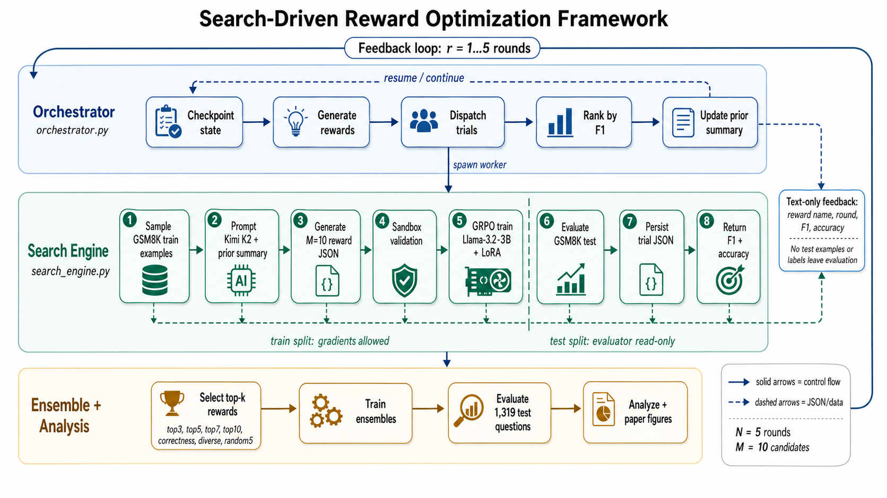

# search-reward-rl

Code for the manuscript **"Enhanced LLM Reasoning by Optimizing Reward Functions with Search-Driven Reinforcement Learning"**.

**Authors:** Arash Ahmadi, Sarah S. Sharif, and Yaser M. Banad (Mike)  
**Affiliation:** School of Electrical and Computer Engineering, University of Oklahoma; INQUIRE Laboratory  

This repository implements a feedback-guided search loop for discovering Python reward functions used during GRPO post-training of small language models on GSM8K. A frontier model proposes candidate rewards, each candidate is validated in a sandbox, a Llama-3.2-3B-Instruct + LoRA policy is trained with the candidate reward, and the resulting model is evaluated on GSM8K test. The best observed rewards are summarized as text and fed back into the next generation round.



## Method Overview

The pipeline is split across two execution layers:

- `orchestrator.py` manages rounds, retries, GPU selection, checkpoint/resume state, ranking, prior-summary updates, and final ensemble scheduling.
- `search_engine.py` is the worker process. It generates rewards, validates generated code, trains individual rewards with GRPO, evaluates saved LoRA adapters, builds ensemble reward functions, and writes per-trial JSON outputs.

The default full run searches for 5 rounds with 10 rewards per round. Each trial trains for 500 GRPO steps and evaluates on the full 1,319-question GSM8K test split. The orchestrator stores resume state in `search_driven_search_results/trial_status.json`, so interrupted runs can continue without retraining completed trials.

## Repository Layout

```text
.
├── framework.png             # Framework diagram
├── search_engine.py          # Reward generation, sandboxing, GRPO training, evaluation, ensembles
├── orchestrator.py           # Round driver, retries, checkpoint/resume state, GPU scheduling
├── analyze_results.py        # Paper figures and aggregate result tables
├── compute_significance.py   # Bootstrap CIs and pairwise McNemar tests
├── flexible_parse.py         # Strict-vs-flexible answer extraction analysis
├── hacking_audit.py          # Reward-hacking audit for top discovered rewards
├── eval_baselines.py         # Ollama baseline evaluation for 2B-4B models
├── list_gpus.py              # GPU discovery helper
├── requirements.txt
├── LICENSE
└── README.md
```

## Core Components

### Reward Search Worker

`search_engine.py` exposes the main execution modes:

```bash
python search_engine.py --mode generate-rewards
python search_engine.py --mode train-single --reward-name <reward_name>
python search_engine.py --mode evaluate --lora-dir <checkpoint_dir>
python search_engine.py --mode ensemble --top-k-names '["reward_a", "reward_b"]'
python search_engine.py --mode mcnemar
```

Reward generation uses Kimi K2 through Groq and asks for JSON containing candidate Python reward functions. Before any generated reward is accepted, it passes four validation stages:

1. AST import-whitelist checks.
2. Locked-down execution with stripped builtins.
3. Restricted-global rebuild with only approved modules/constants.
4. Probe execution that verifies `list[float]` output with the expected batch length.

Accepted candidate rewards are trained alongside the protected base rewards `match_format_exactly`, `match_format_approximately`, and `check_answer`.

### Orchestrator

`orchestrator.py` runs the search end to end:

1. Generate a round of candidate rewards.
2. Train and evaluate each candidate in a separate subprocess.
3. Retry failed trials and generate replacements when needed.
4. Rank all completed rewards by F1 and accuracy.
5. Rebuild `prior_summary` for the next generation prompt.
6. Train and evaluate a final top-k ensemble.
7. Run the cross-model McNemar comparison.

All search artifacts are written under `search_driven_search_results/`; logs are written under `logs/`.

### Analysis Scripts

- `analyze_results.py` builds the ranking tables, F1-by-round plots, ensemble comparisons, training-time-vs-F1 plots, and dashboard artifacts.
- `compute_significance.py` computes bootstrap 95% confidence intervals and pairwise McNemar tests with Bonferroni correction over ensemble runs.
- `flexible_parse.py` recomputes metrics with a numeric-token fallback when strict `<solution>` extraction fails.
- `hacking_audit.py` audits per-question behavior for reward-hacking signals.
- `eval_baselines.py` evaluates off-the-shelf 2B-4B baselines through Ollama under matching decoding conditions.

## Quick Start

### 1. Create the environment

```bash
python -m venv .venv
source .venv/bin/activate
pip install -r requirements.txt
```

The training path assumes a CUDA-capable Linux environment with enough VRAM for Llama-3.2-3B-Instruct + LoRA. The experiments used high-memory NVIDIA GPUs; the code includes GPU selection and cleanup utilities plus 4-bit loading paths for tighter memory budgets.

### 2. Configure the reward-generation API

```bash
export GROQ_API_KEY="<your Groq API key>"
```

### 3. Smoke-test reward generation and one short trial

```bash
python search_engine.py --mode generate-rewards --round 1 --rewards-per-round 2
python search_engine.py --mode train-single \
  --reward-name <one_generated_reward_name> \
  --round 1 \
  --steps 50 \
  --eval-size 64
```

### 4. Run the full search

```bash
python orchestrator.py \
  --num-rounds 5 \
  --rewards-per-round 10 \
  --steps 500 \
  --final-steps 300 \
  --eval-size 1319 \
  --top-k 5
```

Use `--gpu-index <id>` to pin all subprocesses to a specific GPU. Without it, the orchestrator waits for an available GPU from its configured preference order.

### 5. Reproduce analysis artifacts

```bash
python analyze_results.py
python compute_significance.py
python flexible_parse.py
python hacking_audit.py
python eval_baselines.py
```

## Outputs

Typical generated artifacts include:

- `search_driven_search_results/generated_rewards_round*.json`
- `search_driven_search_results/round*_results.json`
- `search_driven_search_results/*_result.json`
- `search_driven_search_results/search_driven_search_summary.json`
- `eval_logs/**/correctness_vector.json`
- `logs/orchestrator_*.log`

Run artifacts, model caches, logs, and spreadsheets are ignored by `.gitignore`.

## License

Code is released under the MIT License. GSM8K is governed by its own license.
